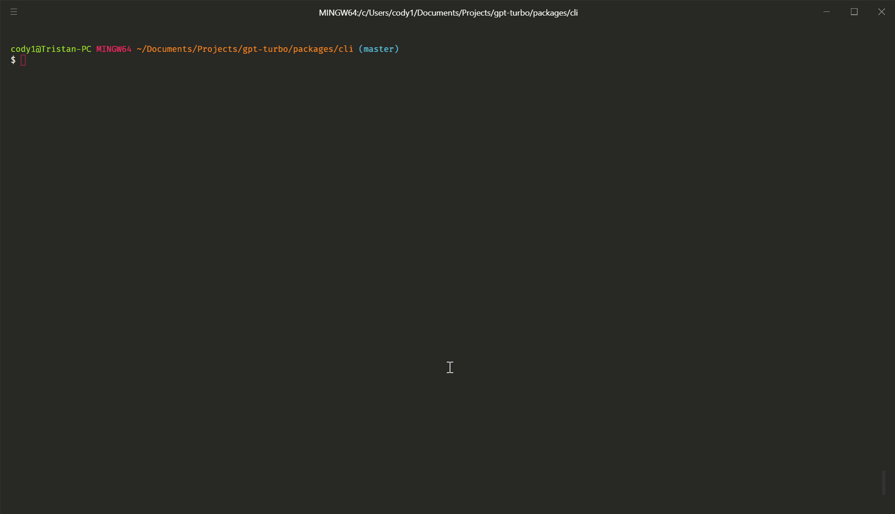

# GPT Turbo - CLI

A CLI that interacts with the gpt-turbo library

<!-- Demo is here: ./demo.gif -->


## Installation

```bash
npm install -g gpt-turbo-cli
```

## Usage

```
# Display help for the CLI
gpt-turbo --help

# Start a conversation with the GPT model
gpt-turbo -k <your OpenAI API key>
```

## CLI Options

Here's a table of the CLI options. Note that all CLI arguments can also be passed as environment variables. For example, you can pass your OpenAI API key as `GPTTURBO_APIKEY` instead of `-k`. Arguments always take precedence over environment variables. Refer to the [library's conversation config](../lib/README.md#conversation-config) for more information on the options default values.

| Argument | Alias | Environment        | Type    | Description                                                                        | Default           | Required |
| -------- | ----- | ------------------ | ------- | ---------------------------------------------------------------------------------- | ----------------- | -------- |
| apiKey   | k     | GPTTURBO_APIKEY    | string  | Your OpenAI API key                                                                |                   | Yes      |
| dry      | d     | GPTTURBO_DRY       | boolean | Run the CLI without sending requests to OpenAI (mirror input as output)            | false             |          |
| model    | m     | GPTTURBO_MODEL     | string  | The model to use.                                                                  | (library default) |          |
| context  | c     | GPTTURBO_CONTEXT   | string  | You are a large language model trained by OpenAI. Answer as concisely as possible. | (library default) |          |
